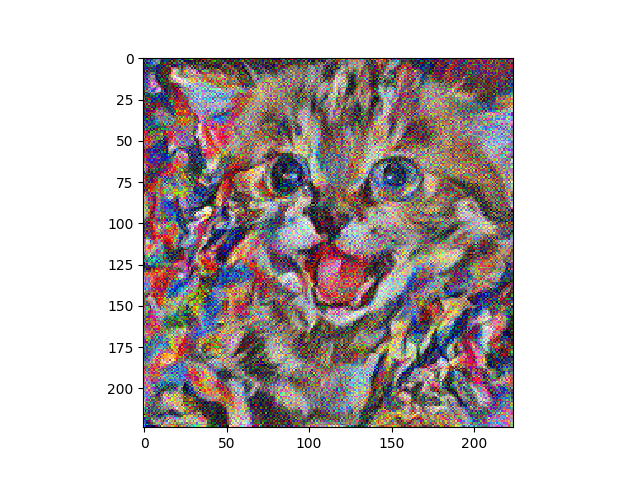

The pre-trained VGG19 model can be found here: <a href = https://mega.nz/#!xZ8glS6J!MAnE91ND_WyfZ_8mvkuSa2YcA7q-1ehfSm-Q1fxOvvs> here </a> and must 
be in the same folder as the code in order to run the program. To run the code, just run the style.py file.

You can change the content and style image by giving the paths to the desired files in the style.py file. 

1) vgg19_style file contains the code for loading the parameters of the pre-trained network. 
2) utils.py contains the code for reading and resizing the input image, and computing the Gram Matrix of the feature map.

A sample output of our code: 
 

